<h1>Rapport de l'architecture Microservices avec Spring Cloud</h1>
<h2>Captures d'écran : </h2>
<h3>1</h3>
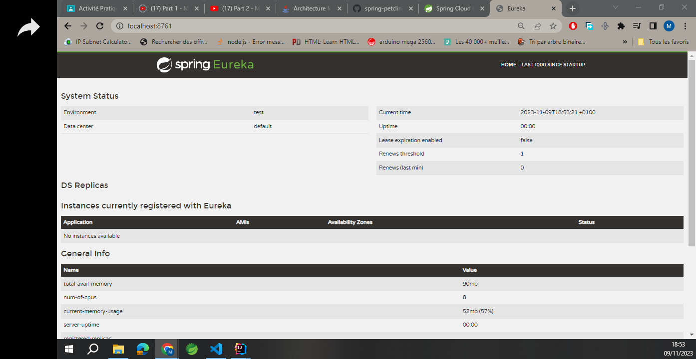
<h3>2</h3>
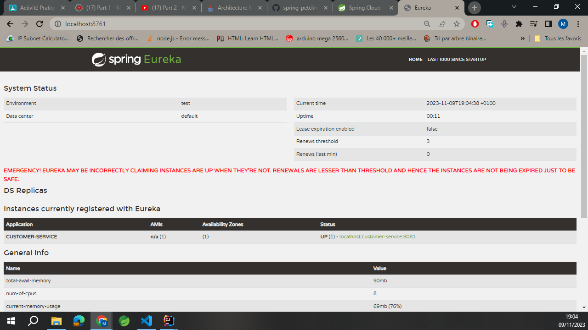
<h3>3</h3>
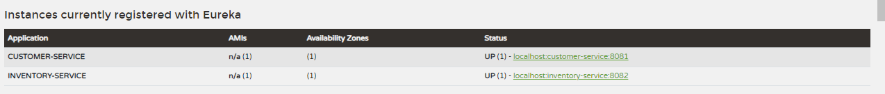
<h3>4</h3>
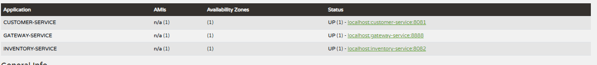
<h3>5</h3>
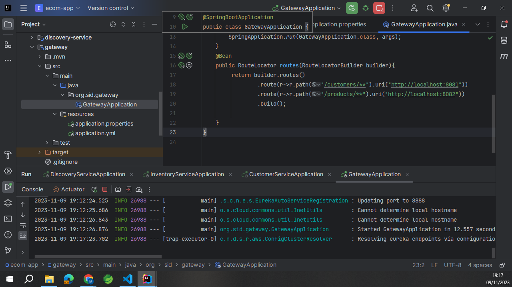
<h3>6</h3>
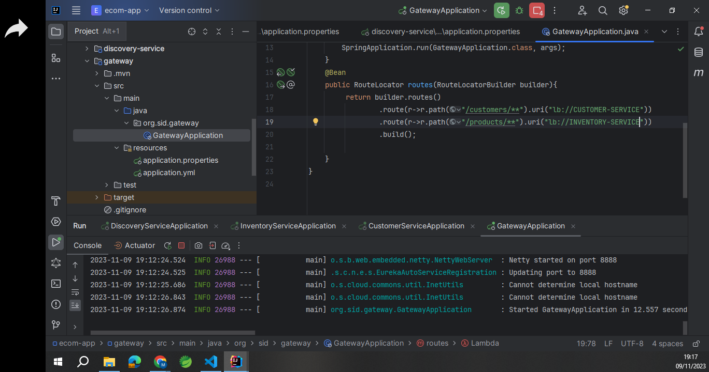
<h3>7</h3>
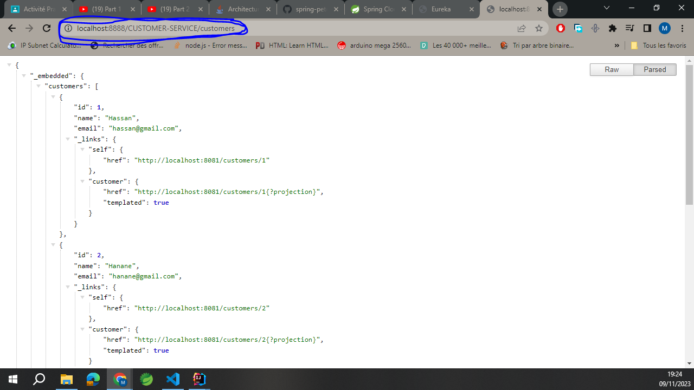
<h3>8</h3>
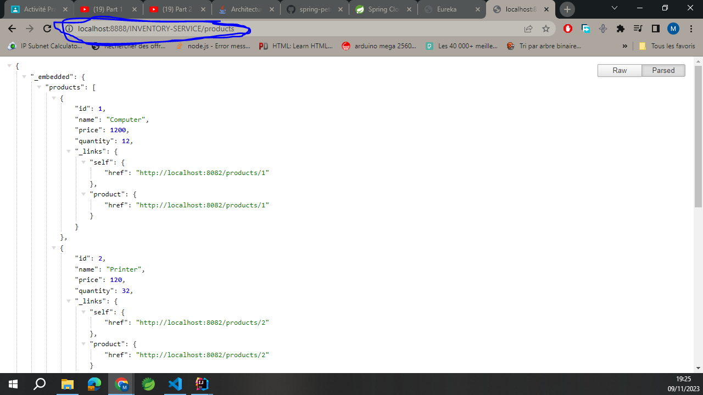
<h3>9</h3>
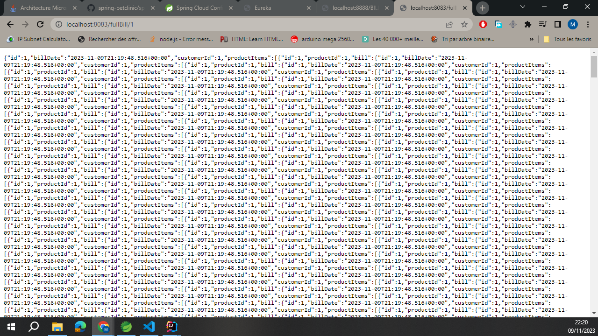
<h3>10</h3>
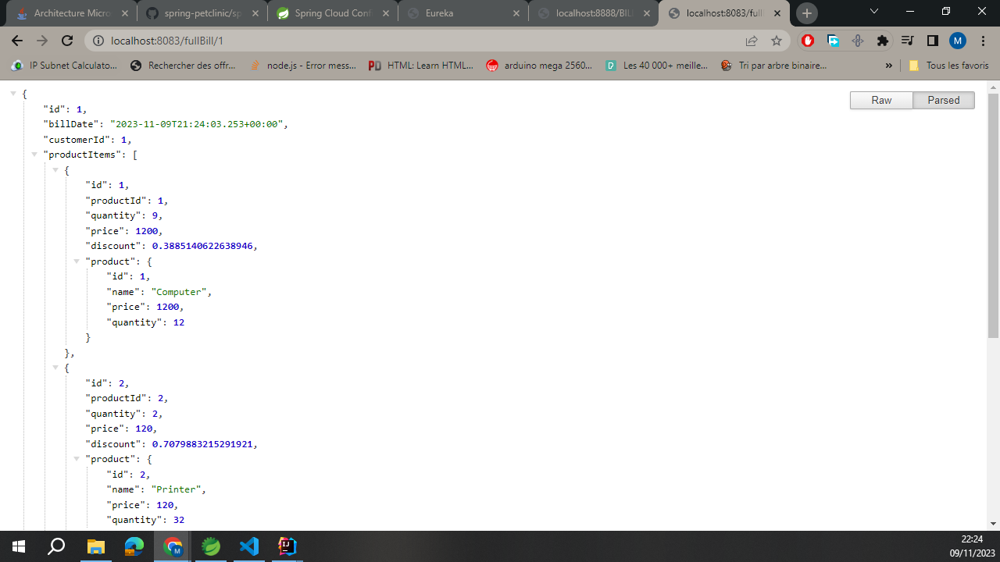
<h3>11</h3>
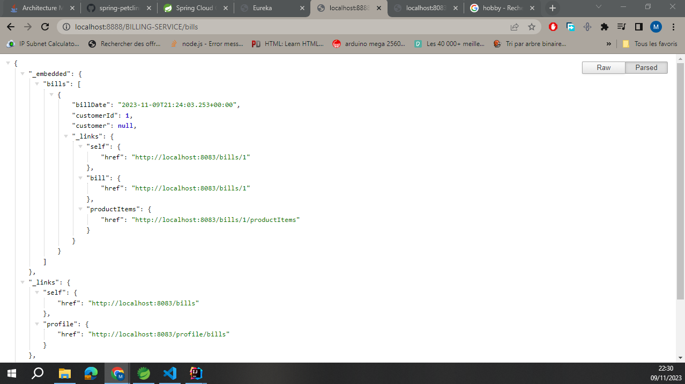

